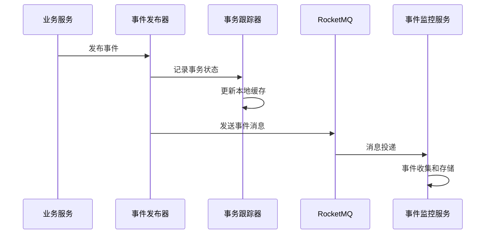
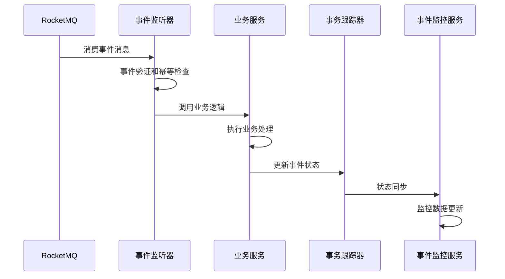
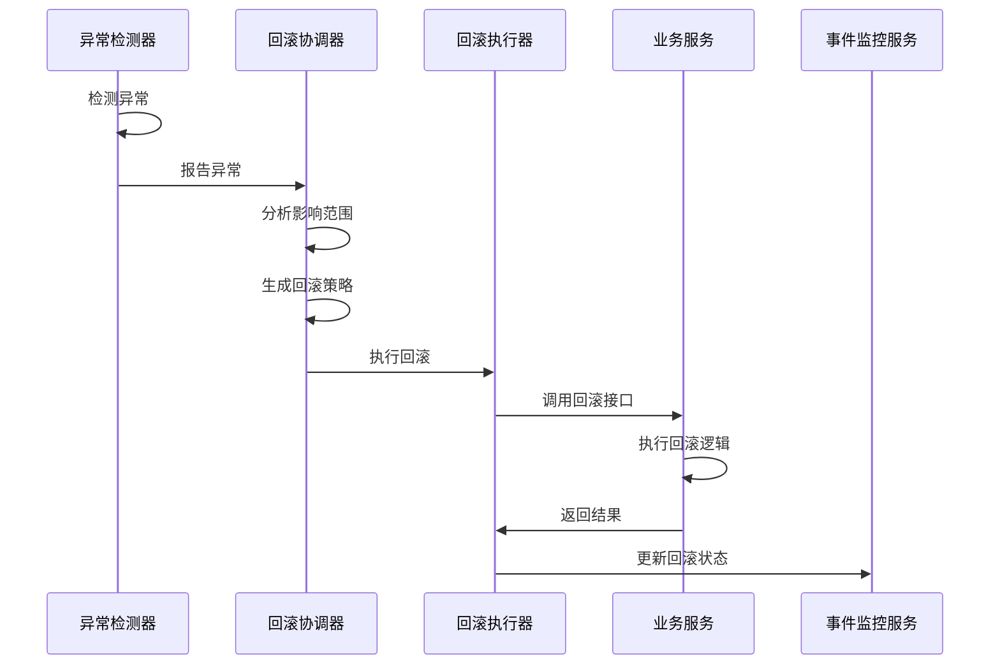

# 事件驱动架构详细设计

## 📋 概述

本文档详细描述了 Synapse Framework 事件驱动分布式事务架构的技术实现细节，包括智能回滚机制、监控服务设计、数据流处理等核心组件的详细设计。

## 🏗️ 详细架构设计

### 1. 模块组织结构

```
synapse-framework/
├── synapse-core/          # 核心工具
├── synapse-cache/         # 缓存服务
├── synapse-security/      # 安全框架
├── synapse-databases/     # 数据访问
└── synapse-events/        # 事件驱动框架 ← 新增
    ├── core/              # 事件核心
    ├── publisher/         # 事件发布
    ├── listener/          # 事件监听
    ├── transaction/       # 事务管理
    ├── rollback/          # 回滚机制
    └── config/            # 配置管理

infrastructure-module/
├── gateway-service/       # 网关服务
├── audit-service/         # 审计服务
├── notification-service/  # 通知服务
├── workflow-service/      # 工作流服务
├── schedule-service/      # 调度服务
├── license-service/       # 许可证服务
├── integration-service/   # 集成服务
└── event-monitor-service/ # 事件监控服务 ← 新增
    ├── collector/         # 事件收集
    ├── analyzer/          # 事件分析
    ├── monitor/           # 监控告警
    ├── rollback/          # 回滚协调
    └── dashboard/         # 监控面板
```

### 2. 核心组件设计

#### 2.1 synapse-events 框架组件

##### 事件发布器 (EventPublisher)
```java
@Component
public class EventPublisher {
    
    /**
     * 发布事件到 RocketMQ
     */
    public void publishEvent(Event event) {
        // 1. 事件预处理
        // 2. 事务状态记录
        // 3. 发送到 RocketMQ
        // 4. 本地状态更新
    }
    
    /**
     * 发布事务事件
     */
    public void publishTransactionEvent(TransactionEvent event) {
        // 1. 事务上下文管理
        // 2. 事件序列化
        // 3. 可靠发送
        // 4. 状态跟踪
    }
}
```

##### 事件监听器 (EventListener)
```java
@Component
public class EventListener {
    
    /**
     * 监听并处理事件
     */
    @EventListener
    public void handleEvent(Event event) {
        // 1. 事件验证
        // 2. 幂等性检查
        // 3. 业务处理
        // 4. 状态更新
    }
    
    /**
     * 处理事务事件
     */
    @EventListener
    public void handleTransactionEvent(TransactionEvent event) {
        // 1. 事务状态检查
        // 2. 依赖关系验证
        // 3. 业务逻辑执行
        // 4. 回滚数据准备
    }
}
```

##### 事务跟踪器 (TransactionTracker)
```java
@Component
public class TransactionTracker {
    
    /**
     * 记录事务开始
     */
    public void recordTransactionStart(String transactionId, String businessType) {
        // 1. 创建事务记录
        // 2. 设置超时时间
        // 3. 缓存事务状态
    }
    
    /**
     * 记录事件状态
     */
    public void recordEventStatus(String eventId, EventStatus status) {
        // 1. 更新事件状态
        // 2. 更新事务统计
        // 3. 检查事务完成
    }
    
    /**
     * 获取事务状态
     */
    public TransactionStatus getTransactionStatus(String transactionId) {
        // 1. 查询缓存
        // 2. 查询数据库
        // 3. 计算状态
    }
}
```

##### 回滚执行器 (RollbackExecutor)
```java
@Component
public class RollbackExecutor {
    
    /**
     * 执行回滚操作
     */
    public RollbackResult executeRollback(RollbackData rollbackData) {
        // 1. 回滚策略选择
        // 2. 服务调用
        // 3. 结果验证
        // 4. 状态更新
    }
    
    /**
     * 智能回滚
     */
    public RollbackResult smartRollback(String transactionId) {
        // 1. 获取事务事件
        // 2. 分析依赖关系
        // 3. 生成回滚策略
        // 4. 执行回滚
    }
}
```

#### 2.2 event-monitor-service 服务组件

##### 事件收集器 (EventCollector)
```java
@Component
public class EventCollector {
    
    /**
     * 从 RocketMQ 收集事件
     */
    @RocketMQMessageListener(topic = "synapse-events")
    public void collectEvent(EventMessage message) {
        // 1. 消息解析
        // 2. 事件验证
        // 3. 数据存储
        // 4. 监控更新
    }
    
    /**
     * 批量处理事件
     */
    public void batchProcessEvents(List<Event> events) {
        // 1. 事件分类
        // 2. 批量存储
        // 3. 性能优化
        // 4. 异常处理
    }
}
```

##### 异常检测器 (AnomalyDetector)
```java
@Component
public class AnomalyDetector {
    
    /**
     * 检测异常事件
     */
    public List<Anomaly> detectAnomalies() {
        // 1. 数据收集
        // 2. 模式识别
        // 3. 异常判断
        // 4. 结果返回
    }
    
    /**
     * 基于规则的异常检测
     */
    public List<Anomaly> ruleBasedDetection() {
        // 1. 规则匹配
        // 2. 阈值检查
        // 3. 异常标记
        // 4. 告警触发
    }
    
    /**
     * 基于统计的异常检测
     */
    public List<Anomaly> statisticalDetection() {
        // 1. 历史数据分析
        // 2. 统计模型计算
        // 3. 异常值检测
        // 4. 结果评估
    }
}
```

##### 回滚协调器 (RollbackCoordinator)
```java
@Component
public class RollbackCoordinator {
    
    /**
     * 协调回滚操作
     */
    public RollbackResult coordinateRollback(String transactionId) {
        // 1. 异常分析
        // 2. 影响评估
        // 3. 策略生成
        // 4. 执行协调
    }
    
    /**
     * 智能回滚决策
     */
    public RollbackDecision makeRollbackDecision(Anomaly anomaly) {
        // 1. 异常类型分析
        // 2. 影响范围计算
        // 3. 策略匹配
        // 4. 决策生成
    }
    
    /**
     * 执行回滚策略
     */
    public RollbackResult executeRollbackStrategy(RollbackStrategy strategy) {
        // 1. 策略验证
        // 2. 服务调用
        // 3. 状态同步
        // 4. 结果验证
    }
}
```

## 🔄 数据流详细设计

### 1. 事件发布数据流



### 2. 事件处理数据流



### 3. 智能回滚数据流



## 📊 监控指标设计

### 1. 事件监控指标

#### 基础指标
- **事件发布速率** - 每秒发布的事件数量
- **事件处理速率** - 每秒处理的事件数量
- **事件成功率** - 事件处理成功的比例
- **事件处理时间** - 事件从发布到处理完成的时间

#### 业务指标
- **事务成功率** - 完整事务成功的比例
- **事务处理时间** - 事务从开始到完成的时间
- **事务回滚率** - 需要回滚的事务比例
- **业务影响范围** - 异常影响的服务数量

### 2. 回滚监控指标

#### 回滚性能指标
- **回滚触发率** - 触发回滚的频率
- **回滚成功率** - 回滚操作成功的比例
- **回滚处理时间** - 回滚操作的处理时间
- **回滚重试次数** - 回滚操作的平均重试次数

#### 回滚质量指标
- **回滚准确性** - 回滚操作的正确性
- **回滚完整性** - 回滚操作的完整性
- **回滚影响评估** - 回滚对业务的影响程度
- **回滚策略效果** - 不同回滚策略的效果对比

### 3. 系统性能指标

#### 资源使用指标
- **CPU 使用率** - 系统 CPU 使用情况
- **内存使用率** - 系统内存使用情况
- **网络 I/O** - 网络输入输出情况
- **磁盘 I/O** - 磁盘输入输出情况

#### 队列指标
- **消息队列长度** - RocketMQ 队列中的消息数量
- **消息处理延迟** - 消息从入队到处理的时间
- **队列积压情况** - 队列积压的严重程度
- **消费者状态** - 消费者的健康状态

## 🎯 智能特性设计

### 1. 异常检测算法

#### 基于规则的检测
```java
public class RuleBasedDetector {
    
    /**
     * 超时检测规则
     */
    public boolean checkTimeout(Event event) {
        long processingTime = System.currentTimeMillis() - event.getCreatedTime();
        return processingTime > getTimeoutThreshold(event.getEventType());
    }
    
    /**
     * 失败率检测规则
     */
    public boolean checkFailureRate(String serviceName) {
        double failureRate = calculateFailureRate(serviceName);
        return failureRate > getFailureRateThreshold();
    }
    
    /**
     * 异常模式检测规则
     */
    public boolean checkAnomalyPattern(List<Event> events) {
        // 检测异常模式
        return detectPattern(events);
    }
}
```

#### 基于统计的检测
```java
public class StatisticalDetector {
    
    /**
     * 移动平均检测
     */
    public boolean checkMovingAverage(List<Double> values) {
        double currentValue = values.get(values.size() - 1);
        double movingAverage = calculateMovingAverage(values);
        double threshold = movingAverage * getThresholdMultiplier();
        
        return Math.abs(currentValue - movingAverage) > threshold;
    }
    
    /**
     * 标准差检测
     */
    public boolean checkStandardDeviation(List<Double> values) {
        double mean = calculateMean(values);
        double stdDev = calculateStandardDeviation(values, mean);
        double currentValue = values.get(values.size() - 1);
        
        return Math.abs(currentValue - mean) > stdDev * getStdDevMultiplier();
    }
}
```

### 2. 回滚策略生成

#### 策略模板
```java
public class RollbackStrategyTemplate {
    
    /**
     * 简单回滚策略
     */
    public RollbackStrategy simpleRollback(String transactionId) {
        return RollbackStrategy.builder()
            .transactionId(transactionId)
            .type(RollbackType.SIMPLE)
            .steps(generateSimpleSteps(transactionId))
            .build();
    }
    
    /**
     * 智能回滚策略
     */
    public RollbackStrategy smartRollback(String transactionId) {
        return RollbackStrategy.builder()
            .transactionId(transactionId)
            .type(RollbackType.SMART)
            .steps(generateSmartSteps(transactionId))
            .parallelExecution(true)
            .build();
    }
    
    /**
     * 渐进回滚策略
     */
    public RollbackStrategy progressiveRollback(String transactionId) {
        return RollbackStrategy.builder()
            .transactionId(transactionId)
            .type(RollbackType.PROGRESSIVE)
            .steps(generateProgressiveSteps(transactionId))
            .checkpointEnabled(true)
            .build();
    }
}
```

#### 策略优化
```java
public class StrategyOptimizer {
    
    /**
     * 基于历史效果优化策略
     */
    public RollbackStrategy optimizeStrategy(RollbackStrategy strategy) {
        // 1. 分析历史效果
        // 2. 识别优化点
        // 3. 调整策略参数
        // 4. 返回优化策略
        return strategy;
    }
    
    /**
     * 动态调整策略
     */
    public RollbackStrategy adjustStrategy(RollbackStrategy strategy, 
                                         RollbackContext context) {
        // 1. 分析当前上下文
        // 2. 调整策略参数
        // 3. 优化执行顺序
        // 4. 返回调整策略
        return strategy;
    }
}
```

## 🔧 配置管理

### 1. 事件配置

```yaml
synapse:
  events:
    # 基础配置
    enabled: true
    version: "1.0.0"
    
    # RocketMQ 配置
    rocketmq:
      name-server: localhost:9876
      producer-group: synapse-events-producer
      consumer-group: synapse-events-consumer
      topic-prefix: "synapse-events"
      retry-times: 3
      timeout: 3000
    
    # Redis 配置
    redis:
      host: localhost
      port: 6379
      database: 0
      timeout: 2000
      key-prefix: "synapse:events:"
    
    # 事务配置
    transaction:
      timeout: 300  # 5分钟
      max-retry: 3
      cleanup-interval: 3600  # 1小时
      
    # 回滚配置
    rollback:
      enabled: true
      strategy: smart  # simple, smart, progressive
      max-retry: 3
      retry-interval: 5000  # 5秒
      parallel-execution: true
      
    # 监控配置
    monitoring:
      enabled: true
      metrics-interval: 60  # 60秒
      alert-enabled: true
```

### 2. 监控服务配置

```yaml
spring:
  application:
    name: event-monitor-service
  
  # 数据源配置
  datasource:
    url: jdbc:mysql://localhost:3306/event_monitor
    username: root
    password: password
    driver-class-name: com.mysql.cj.jdbc.Driver
    hikari:
      maximum-pool-size: 20
      minimum-idle: 5
      connection-timeout: 30000
      
  # Redis 配置
  data:
    redis:
      host: localhost
      port: 6379
      database: 1
      timeout: 2000
      lettuce:
        pool:
          max-active: 8
          max-idle: 8
          min-idle: 0

# 事件监控配置
synapse:
  events:
    monitor:
      # RocketMQ 配置
      rocketmq:
        name-server: localhost:9876
        consumer-group: event-monitor-consumer
        topic: synapse-events
        batch-size: 100
        
      # 数据存储配置
      storage:
        mysql:
          batch-size: 100
          flush-interval: 1000
          table-prefix: "event_"
        redis:
          key-prefix: "monitor:"
          ttl: 86400  # 24小时
          
      # 监控配置
      monitoring:
        prometheus:
          enabled: true
          port: 9090
          path: /actuator/prometheus
        alert:
          enabled: true
          webhook-url: http://localhost:8080/webhook
          
      # 异常检测配置
      anomaly-detection:
        enabled: true
        rule-based:
          enabled: true
          timeout-threshold: 30000  # 30秒
          failure-rate-threshold: 0.1  # 10%
        statistical:
          enabled: true
          window-size: 100
          threshold-multiplier: 2.0
          
      # 回滚配置
      rollback:
        enabled: true
        coordination:
          enabled: true
          strategy-selection: auto  # auto, manual
          parallel-execution: true
        monitoring:
          enabled: true
          success-rate-threshold: 0.9  # 90%
```

## 🚀 部署架构

### 1. 单机部署

```
┌─────────────────────────────────────────────────────────┐
│                    单机部署架构                          │
├─────────────────────────────────────────────────────────┤
│  ┌─────────────┐  ┌─────────────┐  ┌─────────────┐     │
│  │ 业务服务A   │  │ 业务服务B   │  │ 业务服务C   │     │
│  └─────────────┘  └─────────────┘  └─────────────┘     │
│           │              │              │              │
│           └──────────────┼──────────────┘              │
│                          │                             │
│           ┌──────────────▼──────────────┐              │
│           │      synapse-events         │              │
│           └──────────────┬──────────────┘              │
│                          │                             │
│           ┌──────────────▼──────────────┐              │
│           │        RocketMQ             │              │
│           └──────────────┬──────────────┘              │
│                          │                             │
│           ┌──────────────▼──────────────┐              │
│           │   event-monitor-service     │              │
│           └──────────────┬──────────────┘              │
│                          │                             │
│  ┌─────────────┐  ┌─────────────┐  ┌─────────────┐     │
│  │    Redis    │  │    MySQL    │  │  Prometheus │     │
│  └─────────────┘  └─────────────┘  └─────────────┘     │
└─────────────────────────────────────────────────────────┘
```

### 2. 集群部署

```
┌─────────────────────────────────────────────────────────┐
│                    集群部署架构                          │
├─────────────────────────────────────────────────────────┤
│  ┌─────────────┐  ┌─────────────┐  ┌─────────────┐     │
│  │ 业务服务A   │  │ 业务服务B   │  │ 业务服务C   │     │
│  │   (集群)    │  │   (集群)    │  │   (集群)    │     │
│  └─────────────┘  └─────────────┘  └─────────────┘     │
│           │              │              │              │
│           └──────────────┼──────────────┘              │
│                          │                             │
│           ┌──────────────▼──────────────┐              │
│           │      synapse-events         │              │
│           │        (集群)               │              │
│           └──────────────┬──────────────┘              │
│                          │                             │
│           ┌──────────────▼──────────────┐              │
│           │        RocketMQ             │              │
│           │        (集群)               │              │
│           └──────────────┬──────────────┘              │
│                          │                             │
│           ┌──────────────▼──────────────┐              │
│           │   event-monitor-service     │              │
│           │        (集群)               │              │
│           └──────────────┬──────────────┘              │
│                          │                             │
│  ┌─────────────┐  ┌─────────────┐  ┌─────────────┐     │
│  │    Redis    │  │    MySQL    │  │  Prometheus │     │
│  │   (集群)    │  │   (集群)    │  │   (集群)    │     │
│  └─────────────┘  └─────────────┘  └─────────────┘     │
└─────────────────────────────────────────────────────────┘
```

## 📈 性能优化

### 1. 事件处理优化

#### 批量处理
- **事件批量收集** - 批量收集和处理事件
- **数据库批量操作** - 批量插入和更新数据库
- **缓存批量操作** - 批量更新缓存数据

#### 异步处理
- **事件异步发布** - 异步发布事件到消息队列
- **状态异步更新** - 异步更新事件状态
- **监控异步收集** - 异步收集监控数据

### 2. 回滚优化

#### 并行执行
- **并行回滚** - 无依赖关系的服务并行回滚
- **分阶段回滚** - 将回滚操作分为多个阶段
- **增量回滚** - 只回滚发生变化的部分

#### 缓存优化
- **回滚策略缓存** - 缓存常用的回滚策略
- **状态缓存** - 缓存事务和事件状态
- **依赖关系缓存** - 缓存服务依赖关系

### 3. 监控优化

#### 数据压缩
- **事件数据压缩** - 压缩存储的事件数据
- **监控数据压缩** - 压缩监控指标数据
- **日志数据压缩** - 压缩日志数据

#### 数据清理
- **历史数据清理** - 定期清理历史数据
- **临时数据清理** - 清理临时缓存数据
- **过期数据清理** - 清理过期的监控数据

## 🔒 安全设计

### 1. 数据安全

#### 数据加密
- **传输加密** - 使用 TLS/SSL 加密传输数据
- **存储加密** - 加密存储敏感数据
- **缓存加密** - 加密缓存中的敏感数据

#### 访问控制
- **身份认证** - 验证用户身份
- **权限控制** - 控制数据访问权限
- **审计日志** - 记录数据访问日志

### 2. 系统安全

#### 网络安全
- **网络隔离** - 隔离不同网络区域
- **防火墙** - 配置防火墙规则
- **入侵检测** - 检测网络入侵行为

#### 应用安全
- **输入验证** - 验证输入数据
- **SQL 注入防护** - 防止 SQL 注入攻击
- **XSS 防护** - 防止跨站脚本攻击

## 📚 参考资料

- [RocketMQ 架构设计](https://rocketmq.apache.org/docs/architecture/)
- [Redis 集群设计](https://redis.io/topics/cluster-tutorial)
- [MySQL 高可用设计](https://dev.mysql.com/doc/refman/8.0/en/ha-overview.html)
- [Prometheus 监控设计](https://prometheus.io/docs/prometheus/latest/getting_started/)
