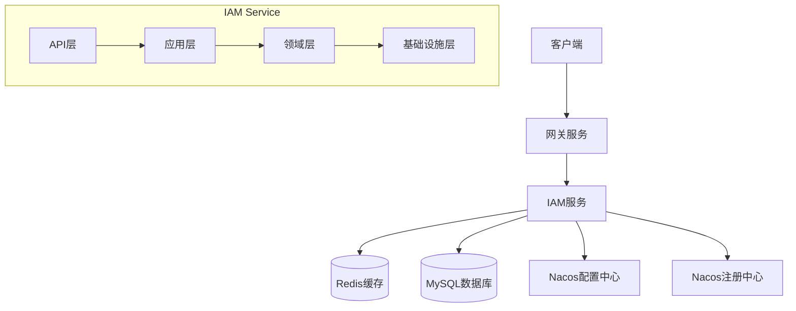
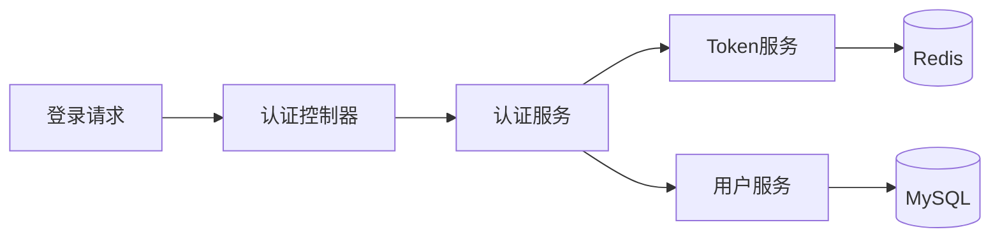
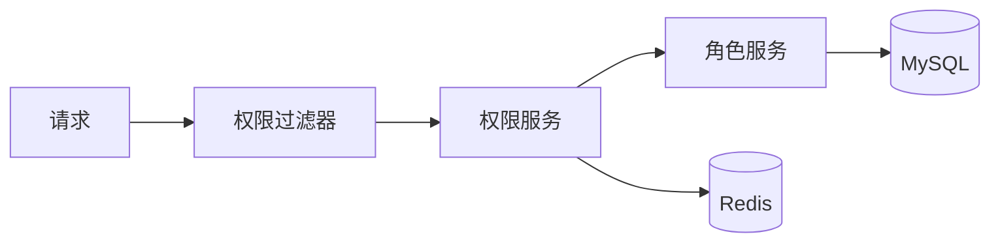
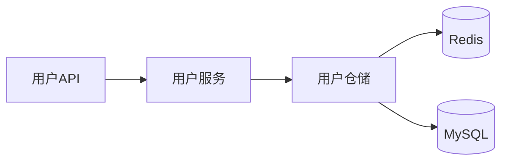
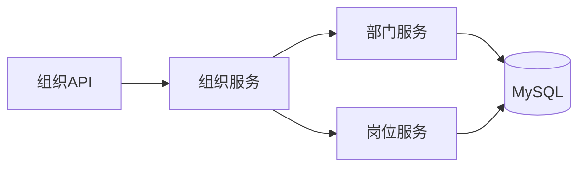

# IAM 服务架构设计

## 整体架构

### 系统架构图

### 分层架构

#### 1. API 层 (interfaces)
- **职责**：处理外部请求，参数校验，响应封装
- **组件**：
  - REST Controllers
  - Facade Services
  - DTO Assemblers

#### 2. 应用层 (application)
- **职责**：编排业务流程，处理用例
- **组件**：
  - Application Services
  - Command Handlers
  - Event Handlers

#### 3. 领域层 (domain)
- **职责**：实现核心业务逻辑
- **组件**：
  - Domain Entities
  - Domain Services
  - Domain Events
  - Repositories (interfaces)

#### 4. 基础设施层 (infrastructure)
- **职责**：提供技术实现
- **组件**：
  - Repository Implementations
  - Cache Services
  - External Service Integrations

## 核心模块

### 1. 认证模块

- **主要组件**：
  - AuthenticationService：认证服务
  - TokenService：令牌管理
  - SecurityContextHolder：安全上下文

### 2. 权限模块

- **主要组件**：
  - PermissionService：权限检查
  - RoleService：角色管理
  - ResourceService：资源管理

### 3. 用户模块

- **主要组件**：
  - UserService：用户管理
  - UserRepository：用户数据访问
  - UserEventHandler：用户事件处理

### 4. 组织架构模块

- **主要组件**：
  - OrganizationService：组织管理
  - DepartmentService：部门管理
  - PositionService：岗位管理

## 关键流程

### 1. 认证流程
1. 用户提交登录请求
2. 认证控制器接收请求
3. 认证服务验证凭据
4. 生成访问令牌
5. 缓存会话信息
6. 返回认证结果

### 2. 权限检查流程
1. 请求到达权限过滤器
2. 提取用户上下文
3. 获取资源权限要求
4. 检查用户权限
5. 判断访问结果
6. 处理授权结果

### 3. 用户管理流程
1. 接收用户操作请求
2. 数据验证和转换
3. 执行业务逻辑
4. 触发领域事件
5. 更新数据存储
6. 返回操作结果

## 安全设计

### 1. 密码安全
- BCrypt 加密算法
- 密码复杂度校验
- 定期密码更新
- 密码重试限制

### 2. 会话安全
- Token 加密存储
- 会话超时控制
- 并发登录控制
- 登出状态同步

### 3. 访问控制
- 最小权限原则
- 角色继承机制
- 动态权限策略
- 资源访问控制

## 性能设计

### 1. 缓存策略
- 多级缓存架构
- 热点数据缓存
- 缓存预热机制
- 缓存一致性保证

### 2. 数据库优化
- 读写分离
- 分库分表
- 索引优化
- 慢查询优化

### 3. 并发处理
- 线程池管理
- 请求限流
- 服务降级
- 负载均衡

## 扩展性设计

### 1. 接口扩展
- 插件化架构
- SPI机制
- 事件驱动
- 微服务架构

### 2. 数据扩展
- 可扩展属性
- 动态表单
- 自定义字段
- 多租户隔离

### 3. 功能扩展
- 认证方式扩展
- 权限模型扩展
- 组织架构扩展
- 业务流程扩展 