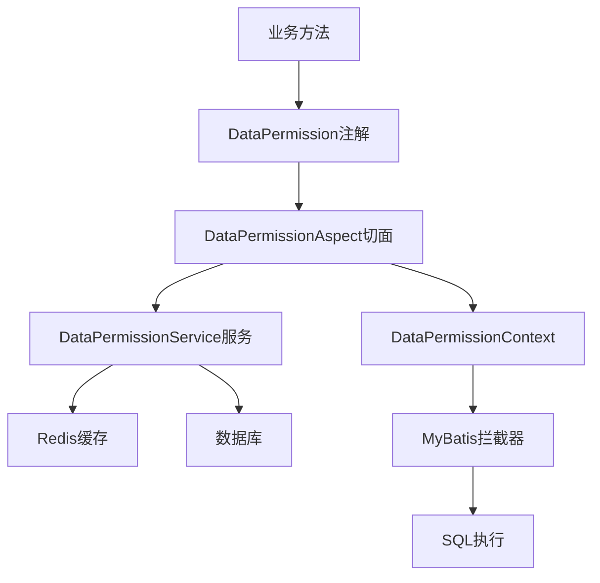

# 数据权限控制设计文档

## 1. 概述

数据权限控制是一种细粒度的权限管理机制，用于控制用户对数据的访问范围。它可以基于用户、角色或部门等维度来限定数据访问范围，例如部门经理只能查看本部门数据，区域主管可以查看所辖区域数据等。

### 1.1 主要特性

- 多维度权限控制：支持用户、角色、部门三个维度的权限规则
- 灵活的数据范围：支持全部数据、本部门、本部门及下级、个人数据、自定义范围等多种数据范围类型
- 优先级机制：通过优先级解决权限规则冲突
- 注解驱动：使用注解实现声明式的权限控制
- 缓存支持：基于Redis的权限规则缓存，提升性能
- 可扩展性：支持自定义数据范围和权限规则

## 2. 系统架构

### 2.1 核心组件



### 2.2 关键类说明

- `DataPermissionRule`: 数据权限规则模型
- `DataPermissionService`: 数据权限服务接口
- `DefaultDataPermissionService`: 默认服务实现
- `DataPermissionAspect`: 权限检查切面
- `@DataPermission`: 权限控制注解
- `DataPermissionContext`: 线程级数据权限上下文

## 3. 权限规则设计

### 3.1 规则属性

```java
public class DataPermissionRule {
    private Long ruleId;         // 规则ID
    private String ruleName;     // 规则名称
    private RuleType ruleType;   // 规则类型（允许/拒绝）
    private SubjectType subjectType; // 主体类型（用户/角色/部门）
    private Long subjectId;      // 主体ID
    private String resourceType; // 资源类型
    private List<PermissionType> permissionTypes; // 权限类型
    private DataScopeType dataScopeType; // 数据范围类型
    private String customScope;  // 自定义数据范围
    private Map<String, Object> conditions; // 规则条件
    private Integer priority;    // 优先级
    private Boolean enabled;     // 是否启用
}
```

### 3.2 数据范围类型

- `ALL`: 可以访问所有数据
- `DEPARTMENT`: 只能访问本部门数据
- `DEPARTMENT_AND_BELOW`: 可以访问本部门及下级部门数据
- `PERSONAL`: 只能访问个人数据
- `CUSTOM`: 自定义数据范围

## 4. 使用指南

### 4.1 添加依赖

```xml
<dependency>
    <groupId>com.indigo</groupId>
    <artifactId>synapse-security</artifactId>
</dependency>
```

### 4.2 配置权限规则

```java
@Service
public class PermissionConfigService {
    
    @Autowired
    private DataPermissionService dataPermissionService;
    
    public void configDepartmentRule() {
        DataPermissionRule rule = DataPermissionRule.builder()
            .ruleName("财务部门数据权限")
            .ruleType(RuleType.ALLOW)
            .subjectType(SubjectType.DEPARTMENT)
            .subjectId(financeDepId)
            .resourceType("finance_record")
            .permissionTypes(List.of(PermissionType.READ))
            .dataScopeType(DataScopeType.DEPARTMENT_AND_BELOW)
            .priority(1)
            .enabled(true)
            .build();
            
        dataPermissionService.addRule(rule);
    }
}
```

### 4.3 使用注解控制权限

```java
@Service
public class FinanceService {
    
    @DataPermission(
        resourceType = "finance_record",
        permissionType = PermissionType.READ
    )
    public List<FinanceRecord> getFinanceRecords() {
        // 方法会自动进行权限检查
        // 数据范围条件会被设置到 DataPermissionContext
        return financeRecordMapper.selectList(new QueryWrapper<>());
    }
}
```

### 4.4 配置MyBatis拦截器

```java
@Configuration
public class MybatisConfig {
    
    @Bean
    public DataPermissionInterceptor dataPermissionInterceptor() {
        return new DataPermissionInterceptor();
    }
}
```

```java
@Intercepts({@Signature(
    type = StatementHandler.class,
    method = "prepare",
    args = {Connection.class, Integer.class}
)})
public class DataPermissionInterceptor implements Interceptor {
    
    @Override
    public Object intercept(Invocation invocation) throws Throwable {
        StatementHandler handler = (StatementHandler) invocation.getTarget();
        String sql = handler.getBoundSql().getSql();
        
        // 获取数据范围条件
        String dataScope = DataPermissionContext.getDataScope();
        if (dataScope != null) {
            sql = addDataScope(sql, dataScope);
        }
        
        // 设置修改后的SQL
        setSQL(handler, sql);
        return invocation.proceed();
    }
}
```

## 5. 最佳实践

### 5.1 权限规则设计建议

1. **最小权限原则**
   - 默认拒绝所有访问
   - 只授予必要的最小权限
   - 优先使用限制性更强的数据范围

2. **优先级设置**
   - 具体规则优先级高于通用规则
   - 否定规则优先级高于肯定规则
   - 保持优先级数值间隔，便于插入新规则

3. **性能优化**
   - 合理使用缓存
   - 避免过于复杂的自定义数据范围
   - 定期清理无用的权限规则

### 5.2 常见使用场景

1. **部门数据隔离**
```java
@DataPermission(resourceType = "employee", permissionType = PermissionType.READ)
public List<Employee> getEmployeeList() {
    return employeeMapper.selectList(null);
}
```

2. **个人数据保护**
```java
@DataPermission(resourceType = "personal_info", permissionType = PermissionType.WRITE)
public void updatePersonalInfo(PersonalInfo info) {
    personalInfoMapper.updateById(info);
}
```

3. **多部门数据共享**
```java
DataPermissionRule rule = DataPermissionRule.builder()
    .ruleName("区域销售数据共享")
    .subjectType(SubjectType.ROLE)
    .subjectId(regionalManagerRoleId)
    .resourceType("sales_record")
    .dataScopeType(DataScopeType.CUSTOM)
    .customScope("region_id IN (SELECT region_id FROM user_regions WHERE user_id = #{userId})")
    .build();
```

## 6. 故障排除

### 6.1 常见问题

1. **权限规则不生效**
   - 检查注解参数是否正确
   - 确认权限规则是否启用
   - 验证缓存是否正常工作

2. **数据范围过滤异常**
   - 检查SQL语句格式
   - 确认数据范围条件正确
   - 验证MyBatis拦截器配置

3. **性能问题**
   - 检查缓存配置
   - 优化权限规则数量
   - 检查数据范围条件复杂度

### 6.2 调试方法

1. 开启DEBUG日志
```yaml
logging:
  level:
    com.indigo.security: DEBUG
```

2. 使用测试工具
```java
@Autowired
private DataPermissionService dataPermissionService;

public void debugPermission(Long userId, String resourceType) {
    UserPrincipal user = getUserPrincipal(userId);
    boolean hasPermission = dataPermissionService.hasPermission(
        user, resourceType, PermissionType.READ
    );
    String dataScope = dataPermissionService.getDataScope(user, resourceType);
    log.debug("Permission check: {}, Data scope: {}", hasPermission, dataScope);
}
```

## 7. 注意事项

1. **安全性**
   - 定期审查权限规则
   - 及时清理离职用户权限
   - 避免过于宽松的数据范围

2. **性能**
   - 合理设置缓存时间
   - 避免过多的权限规则
   - 优化数据范围条件

3. **可维护性**
   - 规范权限规则命名
   - 记录规则变更日志
   - 定期清理无效规则

## 8. 版本历史

- v1.0.0 (2024-01-09)
  - 初始版本
  - 基本的数据权限控制功能
  - 支持注解驱动的权限检查 