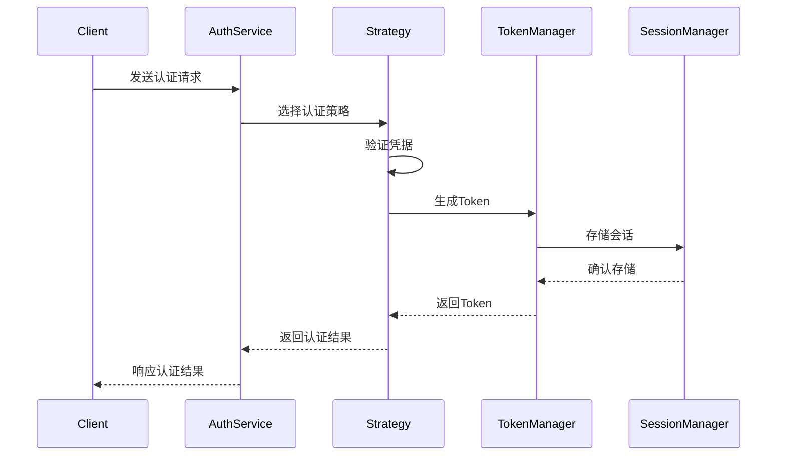

# 认证系统设计

## 📋 概述

认证系统采用策略模式设计，支持多种认证方式，并提供统一的认证接口。系统默认实现了基于 Sa-Token 的认证和 JWT Token 认证，同时支持自定义认证策略的扩展。

## 🎯 核心组件

### 1. 认证服务接口 (AuthenticationService)
```java
public interface AuthenticationService {
    Result<AuthResponse> authenticate(AuthRequest request);
    Result<AuthResponse> renewToken(String token);
}
```

### 2. 认证策略接口 (AuthenticationStrategy)
```java
public interface AuthenticationStrategy {
    String getStrategyType();
    Result<AuthResponse> authenticate(AuthRequest request);
}
```

### 3. 认证请求模型 (AuthRequest)
```java
@Data
@Builder
public class AuthRequest {
    private AuthType authType;
    private String username;
    private String password;
    private String token;
    private String clientId;
    private String clientSecret;
    // ... 其他认证相关字段
}
```

### 4. 认证响应模型 (AuthResponse)
```java
@Data
@Builder
public class AuthResponse {
    private String accessToken;
    private String refreshToken;
    private String tokenType;
    private Long expiresIn;
    private UserPrincipal userPrincipal;
    // ... 其他认证结果字段
}
```

## 🔄 认证流程



## 🛠️ 认证策略实现

### 1. Sa-Token 认证策略
- 实现类：`SaTokenAuthenticationStrategy`
- 特点：
  - 使用 Sa-Token 框架的标准登录流程
  - 支持会话管理和权限验证
  - 适合单体应用和简单微服务

### 2. JWT 认证策略
- 实现类：`JWTAuthenticationStrategy`
- 特点：
  - 生成 JWT 格式的 Token
  - 支持微服务间的无状态认证
  - 适合复杂的微服务架构

### 3. OAuth2 认证策略
- 实现类：`OAuth2AuthenticationStrategy`
- 特点：
  - 支持标准的 OAuth2 授权流程
  - 适合第三方应用集成
  - 支持多种授权模式

## 📦 配置示例

```yaml
synapse:
  security:
    authentication:
      # 默认认证策略
      default-strategy: satoken
      # 策略配置
      strategies:
        satoken:
          token-name: satoken
          timeout: 2592000
        jwt:
          secret: your-secret-key
          expire: 7200
        oauth2:
          enabled: true
          client-id: your-client-id
          client-secret: your-client-secret
```

## 🔧 自定义认证策略

1. 实现 AuthenticationStrategy 接口
```java
@Component
public class CustomAuthStrategy implements AuthenticationStrategy {
    @Override
    public String getStrategyType() {
        return "custom";
    }
    
    @Override
    public Result<AuthResponse> authenticate(AuthRequest request) {
        // 实现自定义认证逻辑
    }
}
```

2. 注册策略
```java
@Configuration
public class SecurityConfig {
    @Bean
    public AuthenticationStrategy customStrategy() {
        return new CustomAuthStrategy();
    }
}
```

## 🔒 安全建议

1. **密码处理**
   - 使用强密码策略
   - 密码加密存储
   - 定期要求修改密码

2. **Token 安全**
   - 合理设置过期时间
   - 使用安全的传输方式
   - 实现 Token 撤销机制

3. **会话管理**
   - 控制并发登录
   - 实现会话超时
   - 提供会话清理机制

4. **审计日志**
   - 记录认证操作
   - 记录重要安全事件
   - 保留足够的审计信息

## 📚 相关文档

- [认证策略详细说明](./strategy.md)
- [JWT 认证实现](./jwt.md)
- [Sa-Token 集成](./sa-token.md)
- [OAuth2 配置](./oauth2.md) 