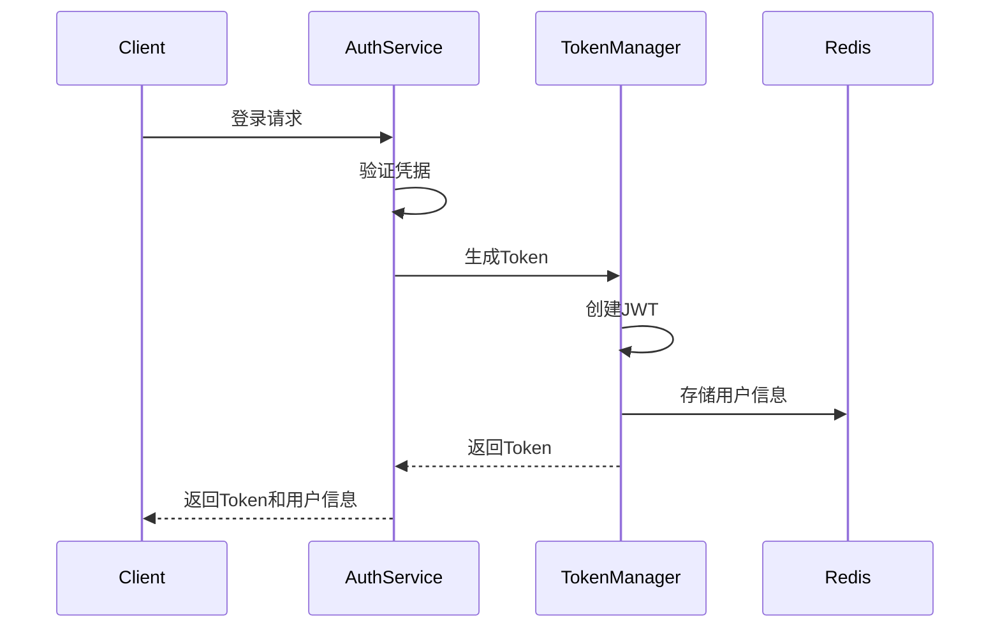
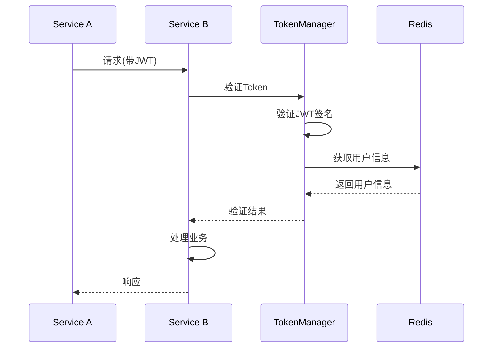

# JWT 认证实现

## 📋 概述

JWT (JSON Web Token) 认证实现基于 Sa-Token 框架，主要用于微服务间的身份验证。采用轻量级的 JWT 格式，确保 token 中只包含必要信息，并通过 Redis 存储完整的用户信息。

## 🎯 核心特性

- **双 Token 机制**: Sa-Token(会话管理) + JWT(微服务调用)
- **轻量级 JWT**: 仅包含必要的身份标识信息
- **Redis 存储**: 完整用户信息存储在 Redis 中
- **自动续期**: Token 自动续期机制
- **分布式验证**: 支持分布式环境下的 Token 验证

## 🔄 JWT 结构

```json
{
  "sub": "10001",                    // 用户ID
  "username": "admin",               // 用户名
  "tenantId": 1,                     // 租户ID
  "sessionId": "uuid-sa-token",      // 关联的Sa-Token会话ID
  "iat": 1234567890,                 // 签发时间
  "exp": 1234567890                  // 过期时间
}
```

## 🛠️ 实现类

### JWTStpLogic
```java
@Component
public class JWTStpLogic extends StpLogic {
    
    public JWTStpLogic() {
        super("jwt");
    }
    
    @Override
    public String getTokenValue() {
        // 自定义JWT token的获取逻辑
        return super.getTokenValue();
    }
}
```

### TokenManager
```java
@Component
public class TokenManager {
    
    private final UserSessionService userSessionService;
    private final SessionManager sessionManager;
    
    public String generateToken(String userId, UserContext userContext) {
        // 生成JWT token
        String token = createJWTToken(userId, userContext);
        // 存储用户信息
        storeUserContext(token, userContext);
        return token;
    }
    
    public boolean validateToken(String token) {
        // 验证JWT token
        return verifyJWTToken(token);
    }
}
```

## 📦 配置示例

```yaml
synapse:
  security:
    jwt:
      enabled: true
      secret: "your-jwt-secret-key"
      expire: 1800                # 30分钟
      renewal:
        enabled: true
        threshold: 300           # 5分钟内自动续期
      token:
        header: "Authorization"
        prefix: "Bearer "
```

## 🔄 认证流程

### 1. 登录流程


### 2. 验证流程


## 🔧 使用示例

### 1. 登录认证
```java
@RestController
@RequiredArgsConstructor
public class AuthController {
    
    private final AuthenticationService authService;
    
    @PostMapping("/login")
    public Result<AuthResponse> login(@RequestBody AuthRequest request) {
        request.setAuthType(AuthType.USERNAME_PASSWORD);
        return authService.authenticate(request);
    }
}
```

### 2. 微服务调用
```java
@Service
public class UserService {
    
    @Autowired
    private RestTemplate restTemplate;
    
    public UserInfo getUserInfo(String userId) {
        HttpHeaders headers = new HttpHeaders();
        headers.setBearerAuth(StpUtil.getTokenValue());
        
        HttpEntity<Void> entity = new HttpEntity<>(headers);
        
        return restTemplate.exchange(
            "http://user-service/api/users/" + userId,
            HttpMethod.GET,
            entity,
            UserInfo.class
        ).getBody();
    }
}
```

## 🔒 安全建议

1. **JWT 密钥管理**
   - 使用足够长度的密钥
   - 定期轮换密钥
   - 安全存储密钥

2. **Token 安全**
   - 合理设置过期时间
   - 实现 Token 撤销机制
   - 使用 HTTPS 传输

3. **信息安全**
   - JWT 中避免存储敏感信息
   - 实现 Token 黑名单
   - 记录重要操作日志

## 🔍 常见问题

### Q1: Token 过期处理
```java
@RestControllerAdvice
public class TokenExceptionHandler {
    
    @ExceptionHandler(TokenExpiredException.class)
    public Result<String> handleTokenExpired(TokenExpiredException e) {
        return Result.error(401, "Token已过期");
    }
}
```

### Q2: Token 自动续期
```java
@Component
public class TokenRenewalService {
    
    @Autowired
    private TokenManager tokenManager;
    
    public String renewalIfNeeded(String token) {
        if (isNeedRenewal(token)) {
            return tokenManager.renewToken(token);
        }
        return token;
    }
}
```

## 📚 相关文档

- [认证系统设计](./README.md)
- [Sa-Token 集成](./sa-token.md)
- [会话管理](../session/README.md) 