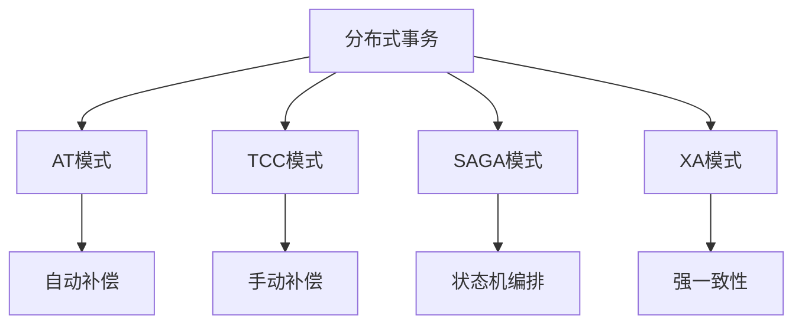

# 分布式事务

## 简介

Synapse Framework 集成了 Seata 作为分布式事务解决方案，提供了 AT、TCC、SAGA 和 XA 四种事务模式的支持。通过简单的注解配置，即可实现跨服务的事务一致性。

## 主要特性

- AT 模式自动补偿
- TCC 模式手动补偿
- SAGA 模式长事务支持
- XA 模式强一致性
- 事务状态可查询
- 失败事务重试
- 事务日志记录
- 高可用集群部署

## 快速开始

### 1. 添加依赖

```xml
<dependency>
    <groupId>io.seata</groupId>
    <artifactId>seata-spring-boot-starter</artifactId>
    <version>${seata.version}</version>
</dependency>
```

### 2. 基础配置

```yaml
seata:
  enabled: true
  application-id: ${spring.application.name}
  tx-service-group: default_tx_group
  service:
    vgroup-mapping:
      default_tx_group: default
  registry:
    type: nacos
    nacos:
      server-addr: localhost:8848
      namespace: public
      group: SEATA_GROUP
  config:
    type: nacos
    nacos:
      server-addr: localhost:8848
      namespace: public
      group: SEATA_GROUP
```

### 3. 使用示例

#### AT 模式
```java
@Service
public class OrderService {
    
    @Autowired
    private AccountService accountService;
    
    @GlobalTransactional
    public void createOrder(Order order) {
        // 创建订单
        orderMapper.insert(order);
        
        // 扣减账户余额
        accountService.deduct(order.getUserId(), order.getAmount());
    }
}
```

#### TCC 模式
```java
@LocalTCC
@Service
public class StockServiceImpl implements StockService {
    
    @TwoPhaseBusinessAction(name = "deductStock", commitMethod = "commit", rollbackMethod = "rollback")
    public boolean prepare(String productId, int count) {
        // 资源预留
        return stockMapper.freeze(productId, count);
    }
    
    public boolean commit(String productId, int count) {
        // 确认扣减
        return stockMapper.confirm(productId, count);
    }
    
    public boolean rollback(String productId, int count) {
        // 释放预留
        return stockMapper.unfreeze(productId, count);
    }
}
```

## 核心概念

### 1. 事务模式



### 2. 角色定义

- **TC (Transaction Coordinator)**: 事务协调者
- **TM (Transaction Manager)**: 事务管理器
- **RM (Resource Manager)**: 资源管理器

### 3. 事务流程

1. TM 向 TC 申请开启全局事务
2. TC 创建全局事务并返回 XID
3. RM 注册分支事务
4. TC 协调提交或回滚

## 配置详解

### 1. 客户端配置

```yaml
seata:
  enabled: true
  # 应用编号
  application-id: ${spring.application.name}
  # 事务分组
  tx-service-group: default_tx_group
  # 启用自动代理
  enable-auto-data-source-proxy: true
  # 数据源代理模式
  data-source-proxy-mode: AT
  # 事务超时时间
  client:
    rm:
      report-success-enable: false
      table-meta-check-enable: false
      saga-branch-register-enable: false
      lock:
        retry-interval: 10
        retry-times: 30
        retry-policy-branch-rollback-on-conflict: true
```

### 2. 服务端配置

```yaml
seata:
  config:
    # 配置中心
    type: nacos
    nacos:
      server-addr: localhost:8848
      namespace: public
      group: SEATA_GROUP
  registry:
    # 注册中心
    type: nacos
    nacos:
      server-addr: localhost:8848
      namespace: public
      group: SEATA_GROUP
  store:
    # 事务日志存储
    mode: db
    db:
      datasource: druid
      db-type: mysql
```

### 3. 事务传播配置

```yaml
seata:
  tx-service-group: default_tx_group
  service:
    vgroup-mapping:
      default_tx_group: default
    grouplist:
      default: localhost:8091
    enable-degrade: false
    disable-global-transaction: false
```

## 最佳实践

### 1. AT 模式最佳实践

- 避免热点数据
- 合理设置隔离级别
- 控制事务边界
- 处理并发冲突

### 2. TCC 模式最佳实践

- 实现幂等性
- 防悬挂处理
- 空回滚处理
- 异步化优化

### 3. 性能优化

- 选择合适事务模式
- 控制事务粒度
- 使用事务连接池
- 合理设置超时时间

## 常见问题

### Q1: 如何处理事务超时？

```java
@GlobalTransactional(timeoutMills = 60000)
public void longTransaction() {
    // 设置较长的超时时间
}
```

### Q2: 如何实现 TCC 防悬挂？

```java
@Service
public class TCCService {
    
    @TwoPhaseBusinessAction(name = "action")
    public void prepare(BusinessActionContext context) {
        // 1. 插入事务控制记录
        String xid = context.getXid();
        if (isExist(xid)) {
            return;
        }
        
        // 2. 执行业务逻辑
        doAction();
    }
}
```

## 更多资源

- [Seata 官方文档](https://seata.io/zh-cn/docs/overview/what-is-seata.html)
- [AT 模式详解](./at-mode.md)
- [TCC 模式详解](./tcc-mode.md)
- [SAGA 模式详解](./saga-mode.md)
- [XA 模式详解](./xa-mode.md) 